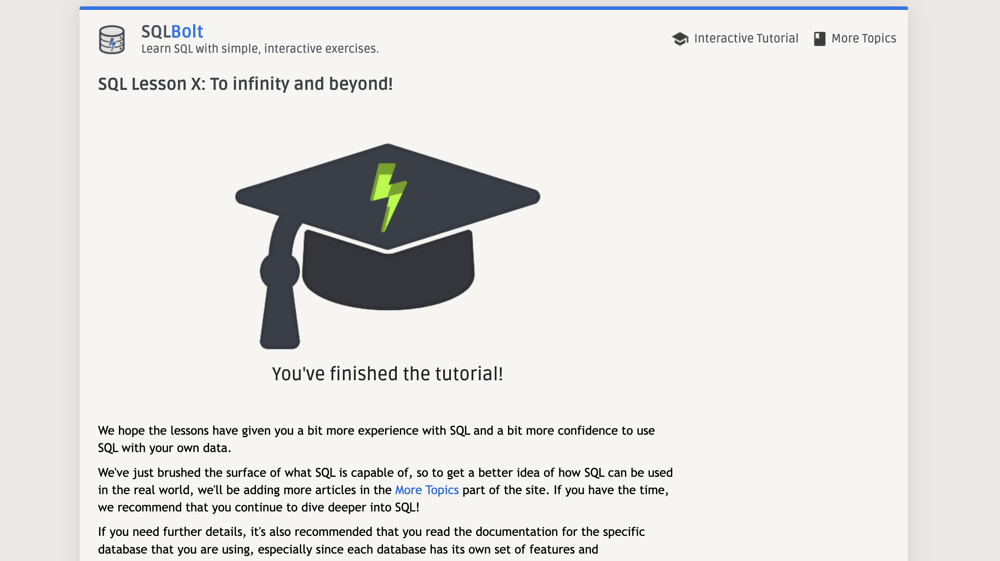

# Reading Notes

This is a website where i can keep track of my observations and questions from the reading assignments throughout Code 401 course.

## Code 401 - Advanced Software Development

## Introduction
Welcome to **Reading Notes**, a website designed to help you keep track of your observations and questions from the reading assignments throughout the Code 401 course. In this advanced software development course, you will delve deeper into the world of coding and gain valuable knowledge and skills.

## Benefits

- **Organizing**
- **Observations**
- **Questions**
- **Accessibility**

> "a way to document and highlight my new knowledge"

I have finished the "Introduction to SQL" prep work, and i learned a lot about SQL Queries and Database management!
Here is a screen shot to confirm finishing it:

<!--  -->

# Prep: Practice in the Terminal

## Bash Command Line Tutorials

 My learnings and observations from completing the Bash Command Line Tutorials :

1. The Command Line 
- What is it and how does it work.

2. Basic Navigation
- An introduction to the directory system 

3. More About Files 
- Find out some interesting characteristics of files and directories.

4. File Manipulation 
- How to make, remove, rename, copy, and move files and directories (it was like a good review to me).

5. Cheat Sheet 
- A quick reference for the main points covered in this tutorial.

--------------------------------------------------

## Data Structures and Algorithms

1. What is 1 of the more important things you should consider when deciding which data structure is best suited to solve a particular problem?

When deciding which data structure to use, it's crucial to consider the efficiency of operations required by the problem, such as insertion, deletion, or search, to ensure optimal performance, also for example if we need a fixed size or not as arrays have fixed size but linked list doesn't and so on.

2. How can we ensure that we’ll avoid an infinite recursive call stack?
To avoid an infinite recursive call stack, we can implement proper base cases in our recursive function, ensuring that the recursion stops at a specific condition. 

--------------------------------------------------

## The Growth Mindset

The growth mindset is emphasized in the article "Upgrade your technical skills with deliberate practice," highlighting the importance of deliberate practice, breaking down skills, and planning for learning and practice. Carol Dweck's TEDxNorrkoping talk on "The power of believing that you can improve" emphasizes the significance of adopting a growth mindset, believing in one's ability to learn and overcome challenges in programming and development.

In terms of emotional intelligence, the self-assessment tool indicates that I have a good overall level of emotional intelligence. I demonstrate self-awareness, self-regulation, and social awareness, with a solid foundation in understanding my emotions, admitting mistakes, and showing empathy. Although there are areas to improve, such as managing biases and negative emotions at work, overall, my results indicate progress and the need to continue working on growth.

Regarding the bias self-assessment, my score falls between 75 and 99, indicating some progress in addressing unconscious bias while recognizing the need for further growth. To continue improving, I should prioritize self-care, challenge myself with new perspectives, and actively seek out diverse opinions to expand my understanding and mitigate bias.

--------------------------------------------------
## Engineering Readings

What’s the one thing I bring to this career (and a potential employer) that nobody else can?

The one thing that sets me apart and makes me a valuable asset in this career and to potential employers is my work ethic and ambition.
I work hard and put all my efforts to achieve my goals, and I always try to focus on solutions instead of problems.

What are 3 things I’ll start doing to “un-stick” myself whenever I get stuck on a tough piece of code, logic, or feature?

Whenever I get stuck on a tough piece of code, I try to do these steps:

1. I give myself a short break if I feel tired and can't focus, its important to stay calm and not be stressed

2. I like to trace the code line by line, sometimes I use a pen and paper if there's a need for it, and it's very helpful

3. searching for potential solutions on the internet, I use different resources like StackOverflow

--------------------------------------------------

## Class 1 - Readings: Exception Handling

1. Name one major benefit of being able to trace the call stack?

One major benefit of being able to trace the call stack during debugging is that it helps in understanding the sequence of program execution. 
This will help to find errors.

2. If you could use try/catch in your day to day life, name an exception you’d like to ‘catch’ and handle?

If I could use try/catch in my day-to-day life, an exception I'd like to 'catch' and the handle is the "DelayException." This would be an exception that occurs when I'm late for something. By catching this exception, I could implement an alternative solution or plan to be on time.

3.From an efficiency standpoint, are there downsides to try/catch blocks?
When an exception is thrown, the program flow is interrupted, and the runtime environment searches for an appropriate catch block to handle the exception which may affect program speed or performance. 
so we should only use it when its important.

4. Describe how you explain the .Net approach to exception handling to a non technical friend?

To explain the .NET approach to exception handling to a non-technical friend, I can give him an example of a situation when we need an alternative solution. 
such as if you can't find a specific product on the market, try to find a similar one from another brand.

--------------------------------------------------

## Class 2 - Readings: Unit Testing and Documentation

1. Three ways in which Unit Testing improves your codebase and productivity are:

- Detecting Bugs Early

- Facilitating Refactoring

- Enhancing Productivity and making the testing faster by automating it.

2. To write a unit test for a household task such as putting away laundry:
-  Write the function that represents the task, such as "puttingAwayLaundry()".

- Write test cases for different scenarios. we might have test cases for different types of clothes or colors.

- Invoke the "putAwayLaundry()" method with the test inputs.

- Evaluate the testing result is the same as the expected one.

 

3. Three reasons a quality README is just as important as quality code are:

- It will help other developers who want to understand the code if they want to use it, just like documentation. 

- It will make collaboration easier between the team.
- It will guide you on how to deal with the code so you can run it on your computer

4. Four crucial elements to include when writing a README for co-developers are:

1. An overview about the project

2. How to install and set up the project

3.how to use the project with an example use cases. 

4. Any other guidelines

--------------------------------------------------

## Class 3 - Readings: File Manipulation / System.IO

This topic is important because as developers it allows us to do many operations on files such as creating, reading, appending, and writing to the file.

In C#, "File Manipulation/System.IO" refers to the collection of classes and methods made available by the System.IO namespace.
It provides many operations for handling files.

### I learned about many classes like: 

File I/O:

- File class
- StreamReader and StreamWriter classes

Stream I/O:

- FileStream class

- StreamReader and StreamWriter classes

- BinaryReader and BinaryWriter

## Things I want to know more about

I want to know in what kind of projects I will need to work with files, so i want to see real examples.

--------------------------------------------------

## Class 4 - Readings: Classes & Memory Management

### Constructor

1. What’s the difference between a static and an instance constructor?

In c#,  "static constructor " is used to initialize static members of a class, It is declared using the static keyword and does not take any parameters.

On the other hand, "instance constructor" is used to create an instance of a class. It is called when a new instance of the class is created using the "new" keyword and it takes parameters.

2. How does the use of a static constructor differ from setting properties/values?

A static constructor is used to initialize static members, while setting properties/values is a way to initialize instance members.

Also, we can set properties/values many times on different instances, not only one time

### Stack and Heap

3. Knowing what you now know about the stack and the heap, how might you rethink the way you did projects in previous courses, to make more effecient use of memory?

I think I would use the stalk to keep track of the methods execution, and I will be more careful when I use Value Types and Reference Types
as using Reference Types in the wrong way might affect the performance.
This is what I'm thinking based on my understanding of the article, but of course, I'm excited to understand this topic more deeply so I can make more effecient use of memory

### Garbage Collector

4. Compare “Garbage Collection” in C# with the lifecycle of normal household items.

Every once in a while, we need to get rid of unused things in the house to keep it organized and clean. They were useful at a specific time, but now they are just taking up space!

Same as Garbage Collector in c#, it identifies and removes objects that are no longer being used, to free the memory.

--------------------------------------------------

## Class 5 - Readings: Linked Lists

##  Big O
Big O notation is a way to measure the efficiency of algorithms and data structures.
by big O we can analyze the performance based on the time complexity, space complexity, and the input size(n), for the best and the worst case scenarios

In this way, we can decide which is the best data structure or algorithm to use for the software.

## Linked lists
Linked lists are a data structure that has two types (singly and doubly).
linked lists have no fixed size and no index, and they don't require contiguous memory allocation, so it differs from arrays and it has their benefits of use.

Linked lists consist of nodes and pointers, where pointers are references to the next node in the SLL, and in DLL there are pointers for the next and previous nodes

we prefer to use Linked lists when we need flexibility for memory and we don't want a fixed size, but we don't prefer it when we need quick access for elements as it has linear complexity.

--------------------------------------------------

## Class 6 - Object Oriented Principles

### Inheritance

Inheritance enables you to create new classes that extend and modify the behavior defined in other classes.
Where the parent class is called also a base class, and the class that inherits those members is called a derived class.

To extend a class in C#, we use the : (colon) symbol.

### Abstract 

In c#, we can use the "abstract" keyword, which enables us to create classes and class members that are incomplete and must be implemented in a derived class.
As the abstract methods have no implementation, the method definition is followed by a semicolon instead of a block.

### Sealed

Also, we have "sealed"  keyword, which is used to prevent a class from being inherited or overridden.
As the sealed class can't be used as a base class, and it cannot be further derived from.
we prevent inheritance by adding "sealed" class
and we prevent overriding the method by adding the sealed keyword before the override keyword.

### Polymorphism

Polymorphism means "many-shaped", it allows override methods in derived classes that share a base class.
So when we create objects it will have different behaviors based on their actual types. just like a circle and rectangle from a class shape, every shape will have different behavior.

In C#, we can use the "virtual" keyword to declare a method or class member in a base class that can be overridden in derived classes.
It provides a mechanism for polymorphism and allows derived classes to have their own implementation of the virtual member.

### Hide base class members with new members (new)

Also, there is the "new" keyword, In case we want the derived class to have a member with the same name as a member in a base class; we can use "new" to hide the base class member.
It becomes before the return type of a class member that is being replaced.

--------------------------------------------------

## Class 7 - Interfaces

### Interfaces - define behavior for multiple types

**An interface in C# contains definition of a set of related functionalities that must be implemented by a non-abstract class. It allows for defining static methods with implementations and provides the option to include default implementations for its members.**

To create an interface, you use the "interface" keyword, and interface names begin with a capital "I".

By default, interface members are public, but you can explicitly specify accessibility modifiers such as public, protected, and so on.

**properties and methods in c# interfaces are public by default, and implicitly abstract**

In order to implement an interface member, the corresponding member in the implementing class must be public, non-static, and have the same name and signature as the interface member.

- An interface can define default implementations for some or all of its members. When a class implements the interface, it is not required to implement members that have default implementations.

- C# doesn't support multiple inheritance of classes. A class can only inherit from a single class, but it can implement multiple interfaces.

#### What is the problem that the interface solves?
The basic problem an interface is trying to solve is to separate how we use something from how it is implemented.

this means that if we have a Driver class it should be able to have a method Drive that can be used to drive any car, boat, or other kind of class that implements the IDriveable interface.

### Default interface members
Members with bodies allow the interface to provide a "default" implementation for classes that don't provide an overriding implementation

### Interface instances
An explicitly implemented member can't be accessed through a class instance, but only through an instance of the interface. In addition, default interface members can only be accessed through an instance of the interface.

--------------------------------------------------

## Class 8 - Collections & Enums

## Collections

In c#, collections are used to group related objects. There are two main ways to group objects: using arrays or using collections.

Collections offer more flexibility compared to arrays. They allow the group of objects to dynamically grow or shrink as needed. In some collections, you can assign a key to each object, making it easy to retrieve objects based on the key.

If your collection only contains elements of a single data type, you can use the classes in the System.Collections.Generic namespace. These generic collections ensure type safety, preventing the addition of objects of other data types. When retrieving an element from a generic collection, you don't need to determine its data type or convert it.

There are different kinds of collections available:

- System.Collections.Generic classes: These enforce strong typing and only allow the desired data type to be added.
- System.Collections.Concurrent classes: These are used in scenarios where multiple threads are accessing the collection concurrently.
- System.Collections classes: These store elements as objects of type Object without specific typing.

LINQ (Language-Integrated Query) can be used to perform queries on collections, making it easier to access and manipulate the data.

If you want to define your own custom collection, you can do so by implementing either the IEnumerable <T<T>> or IEnumerable interface.

## Enumeration Types

An enumeration type, also known as an enum type, is a (value type) that consists of a set of named constants with underlying integral numeric values. 
We can define an enumeration type by the "enum" keyword and specify the names of the enum members.

Enumeration types are useful when you want to represent a choice from a set or a combination of choices. 

In addition to representing mutually exclusive choices, enum types can also be used as bit flags. By using bitwise operations, you can combine multiple enum values into a single value to represent a combination of choices.

Using enumeration types provides several benefits, including improved code readability, type safety, and ease of maintenance. Enum members serve as self-descriptive constants, making the code more expressive and easier to understand.

enumeration types are helpful for defining sets of named constants with integral values, allowing for clearer and more structured representation of choices and combinations in your code.

--------------------------------------------------

## Class 9 - LINQ & Delegates

## Language Integrated Query (LINQ) (C#)

LINQ is a set of technologies that enables queries to be directly integrated into the C#.
With LINQ, developers don't need to use different query languages for various data sources like SQL databases, XML documents, and web services.
LINQ queries can be written in C# for SQL Server databases, XML documents, and any collection of objects that support IEnumerable or the generic IEnumerable<T<T>> interface. 

With LINQ, developers can write queries as first-class language constructs, similar to classes and methods.
We can use familiar operators and keywords to query strongly typed collections of objects. so we can perform filtering, ordering, and grouping operations on different data sources with minimal code. 

Query expressions can be compiled to expression trees or to delegates, depending on the type that the query is applied to. IEnumerable <T<T>> queries are compiled to delegates. IQueryable and IQueryable<T<T>> queries are compiled to expression trees.

## Introduction to LINQ Queries (C#)

A query is an expression that retrieves data from a data source. 

developers have had to learn a new query language for each type of data source for example, SQL for relational databases and XQuery for XML.

But LINQ simplifies this situation, As in a LINQ query, you are always working with objects. You use the same basic coding patterns to query and transform data in any format LINQ provides.

Three Parts of a Query Operation:

1. Obtain the data source.
2. Create the query.
3. Execute the query (for example in a foreach statement).

### Forcing Immediate Execution

Queries that involve aggregation functions like Count, Max, Average, and First, don't require an explicit foreach statement because the query itself internally utilizes foreach to produce a result. It's important to note that these queries return a single value rather than an IEnumerable collection. Basic LINQ Query Operations (C#)

In a LINQ query, the "from" clause comes first in order to introduce the data source and the range variable, The range variable is like the iteration variable in a foreach loop.

- Filtering (where)
- Ordering (order by)
- Grouping (group by)
- Joining (join)

--------------------------------------------------

## Class 10 - Stacks and Queues

### Stack 
**is a linear data structure that follows the Last-In-First-Out (LIFO) principle.** 

It consists of Nodes, where each Node references the next Node in the stack, but does not reference its previous one.

The stack supports two main operations:
1. Push: add an element to the top of the stack
2. Pop: removes the top element from the stack.

and we also have a peek to get the top value, and IsEmpty to check if it's empty.
The time complexity for all of them is O(1)

### Queue
 **It is another linear data structure that follows the First-In-First-Out (FIFO) principle.**

 The queue supports many operations: 
1. enqueue:  add an element to the rear (end) of the queue
2. dequeue:  remove the element at the front of the queue.

And same as the stack we have peek and IsEmpty

--------------------------------------------------

## Class 11 - Introduction to Databases and ERDs

1. **What is a Schema?**  
A schema in a database defines how data is organized within a relational database, such as tables.
Schemas provide a way to group related entities and manage access permissions.

    **Why do we use them?**  
It helps to build and manage databases, by organizing the database and managing access control.

     **What do they look like?**  
It looks like a diagram with many arrows that represent relations between entities

2. **What are the different types of Database Keys?**  

- **Primary Key**: a unique identifier for a row in a table. 
- **Foreign Key**:  it comes by having a relationship between two tables by referencing the primary key of the other table.

- **Composite Key**:  is used when a single column cannot uniquely identify a row. So it is a primary key that consists of multiple fields to create a unique identifier for a record.

  **How are they different? When do you use one over the others?**  
- primary key used when we have a unique identifier for each row in a table.
- foreign key used when we have relationships between tables 

- composite key used when a single column cannot uniquely identify a record

3. **What are Relationships in a relational database?**  
Relationships define the relations between tables in a relational database.

   **What is a 1:1 relationship?**  
It's when each record in one table is related to exactly one record in another table.

    **What is a Many: Many relationship?**  
when multiple records in one table are related to multiple records in another table. When we have many:many relationships we need a junction table to associate the related records between the two tables.

   **What is a 1:Many or Many:1 relationship?**  
when each record in one table can be related to multiple records in another table, but each record in the related table is related to only one record in the first table. 

--------------------------------------------------

## Class 12 - Entity Framework and APIs

### Entity Framework Core

Entity Framework Core is an object-relational mapping (ORM) framework for .NET, that allows developers to work with databases using object-oriented concepts.

It simplifies database operations by enabling developers to interact with the database using familiar things such as classes, objects, and LINQ (Language-Integrated Query). 
Entity Framework Core supports various database providers and allows for the creation, retrieval, modification, and deletion of data without the need to write complex SQL queries manually.
It also offers many features that make it an efficient tool for building data-driven applications in . NET.

### Data Seeding

data seeding is a process of inserting an initial set of data into the database.

 It can be accomplished in several in EF Core:

- Model seed data: where the data is associated with an entity type in the model configuration

- Manual migration customization: where explicit calls to InsertData(), UpdateData(), and DeleteData() are added to the migration

- Custom initialization logic: where DbContext.SaveChanges() is used before the main application logic to seed the data

The choice of which way to use depends on the application requirements and constraints.

### User secrets

In .NET Core, User secrets provide a secure way to store sensitive user information separately, such as API keys and connection strings.

By enabling user secrets, we can store this confidential data in a secrets.json file, which is not uploaded to source control.

It can be easily managed through Visual Studio, and the stored secrets can be accessed in the application using the IConfiguration interface.

--------------------------------------------------

## Class 13 - Dependency Injection & Repository Design Pattern

1. **Dependency Injection:**
Dependency Injection (DI) is a design pattern in .NET, used to achieve loose coupling between components. 
It allows the dependencies of a class to be "injected" from the outside instead of creating them internally. 

2. **Repository Design Pattern:**
repository pattern has two purposes: 
- it is an abstraction of the data layer 
- it is a way of centralizing the handling of the domain objects.

It abstracts the data storage details, allowing the rest of the application to interact with data objects using a simplified interface. 

When combined with an ORM like Entity Framework, the pattern simplifies data access code, the Repository acts as an intermediary between domain objects and data mapping, providing a clear separation of dependencies and a organize working with data sources.

3. **SOLID Principles:**
SOLID is a set of five design principles for writing maintainable and scalable object-oriented software:

   - **Single Responsibility Principle (SRP):** A class should have only one reason to change, meaning it should have a single responsibility or purpose.
   - **Open/Closed Principle (OCP):** Software entities (classes, modules, etc.) should be open for extension but closed for modification, allowing new functionality to be added without altering existing code.
   - **Liskov Substitution Principle (LSP):** Objects of a superclass should be replaceable with objects of its subclasses without affecting the correctness of the program.
   - **Interface Segregation Principle (ISP):** Clients should not be forced to depend on interfaces they do not use, promoting the creation of specific interfaces for individual use cases.
   - **Dependency Inversion Principle (DIP):** High-level modules should not depend on low-level modules. 
Both should depend on abstractions, this principle encourages the use of dependency injection to achieve loose coupling.

5. **Why SOLID Matters:**

1- **Single Responsibility Principle (SRP):**
A class should have only one reason to change, meaning it should serve a singular purpose. Avoiding Swiss Army knife-like complexity in code brings clarity and maintainability by keeping methods focused and short.

2- **Open Closed Principle (OCP):**
Modules should be open for extension but closed for modification. Instead of constantly editing base code, use extensions like polymorphism to alter or add functionality, reducing the risk of introducing bugs.

3- **Liskov Substitution Principle (LSP):**
Subclasses should be substitutable for their base classes without impacting the client code's functionality. Just as ordering a salad at a restaurant doesn't change how you eat it, derived classes must seamlessly integrate with the client code.

4- **Interface Segregation Principle (ISP):**
Prefer having client-specific interfaces over a general-purpose one. Fine-grained interfaces prevent analysis paralysis and offer tailored options for consuming classes.

5- **Dependency Inversion Principle (DIP):**
Depend on abstractions, not concrete implementations. Code that directly instantiates concrete classes limits flexibility. Using interfaces enables easy switching between implementations, akin to driving different cars without altering your driving code.

--------------------------------------------------

## Class 14 - Navigation Properties and Routing

#### ASP.NET MVC Routing Overview (C#)

The tutorial introduced how ASP.NET Routing works, and how incoming requests are mapped to specific controller actions based on the URL structure and the route table.

It mentions the Global.asax file that contains event handlers for ASP.NET application lifecycle events.
In the Global.asax, the route table is created during the Application_Start event.
When an MVC application first starts, the Application_Start() method is called. This method, in turn, calls the RegisterRoutes() method. The RegisterRoutes() method creates the route table.

#### Routing in ASP.NET Core

**Routing is responsible for matching incoming HTTP requests and dispatching those requests to the app's executable endpoints.**
It plays a role in determining how the application responds to different URLs and HTTP methods.

The routing system can handle different types of HTTP requests like (GET, POST, PUT, DELETE) and map them to different endpoints.

In ASP.NET Core, the routing system is responsible for interpreting the request URL and extracting relevant information like controller, action, and parameters, in order to invoke the appropriate code to handle the request. 

The routing system works with a set of rules called routes, which defines is a pattern to match the incoming request URL and extracts relevant data from it.

